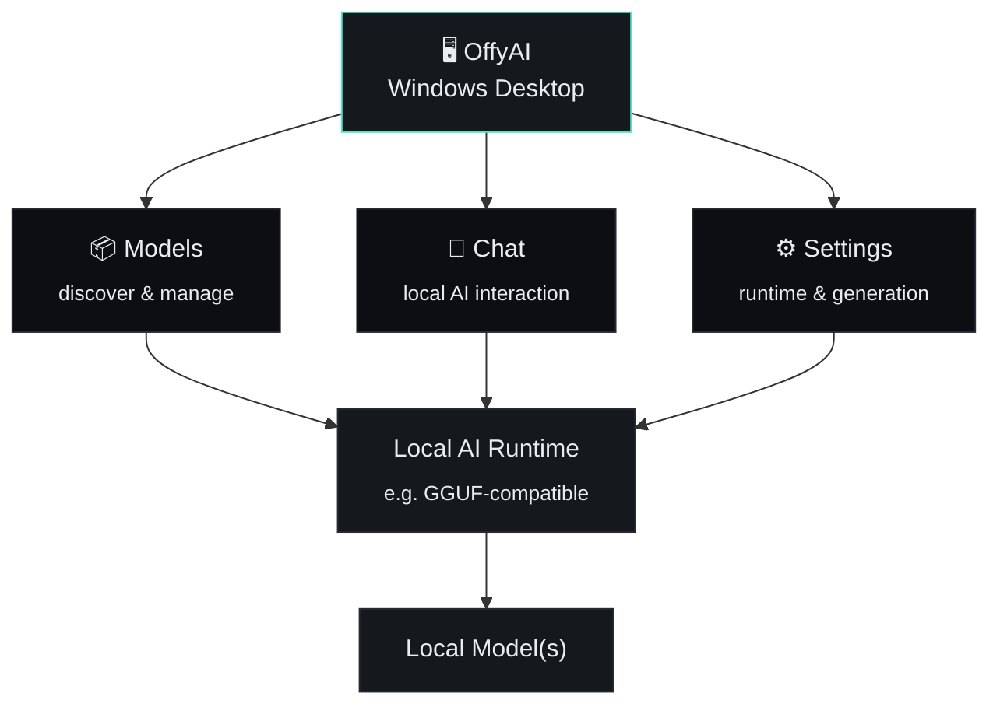
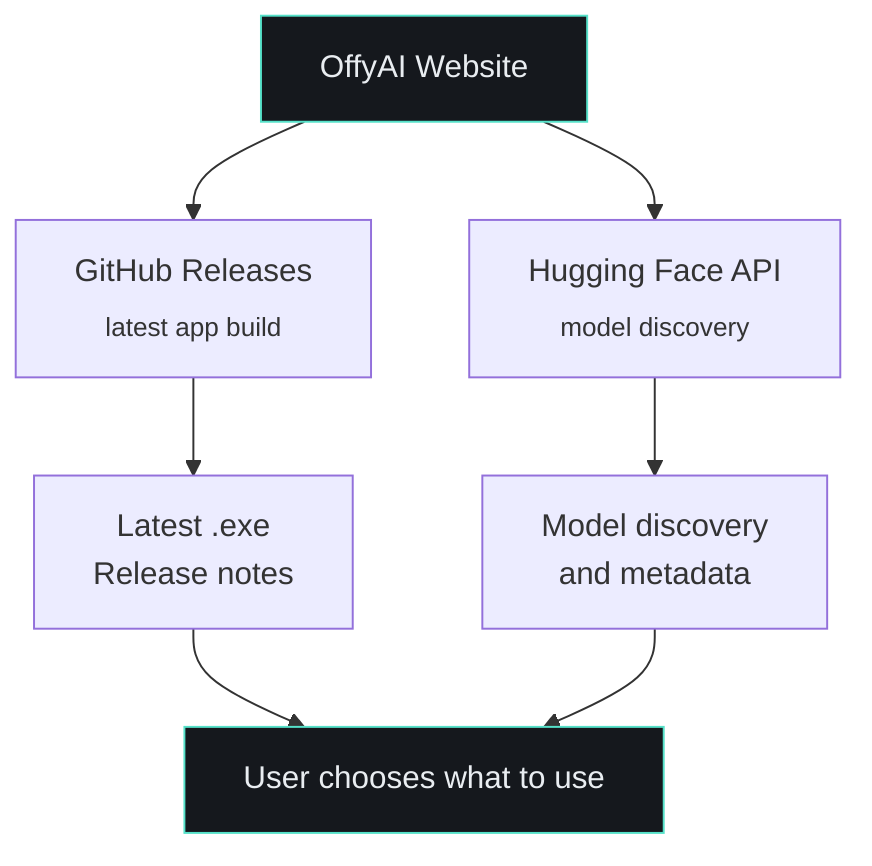
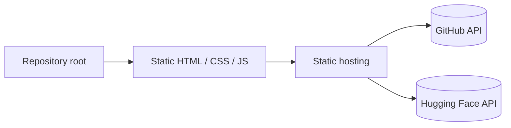
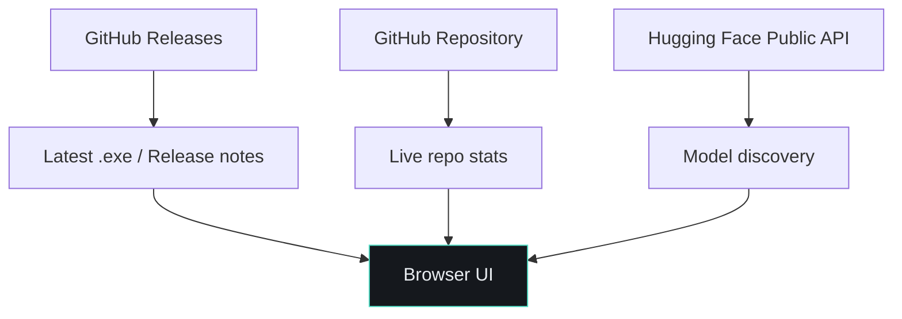

<div align="center">


# OffyAI

### Private. Fast. Local. Yours.

A local-first Windows AI desktop application for discovering, managing, and interacting with local AI models.

<p>


</p>

<p>
<a href="https://offyai.vercel.app/"><strong>Website</strong></a> ·
<a href="https://github.com/bharat-poojari/offyai/releases/latest"><strong>Download</strong></a> ·
<a href="https://github.com/bharat-poojari/offyai/issues"><strong>Issues</strong></a> ·
<a href="https://github.com/bharat-poojari/offyai/discussions"><strong>Discussions</strong></a>
</p>


</div>

<br>

<table align="center">
<tr>
<td align="center" width="140"><h3>🖥️</h3><b>Desktop-first</b><br><sub>Windows native app</sub></td>
<td align="center" width="140"><h3>🔒</h3><b>Local-first</b><br><sub>No forced cloud calls</sub></td>
<td align="center" width="140"><h3>🤖</h3><b>Model-centric</b><br><sub>Discover & manage</sub></td>
<td align="center" width="140"><h3>⚙️</h3><b>Tunable</b><br><sub>Runtime & generation</sub></td>
<td align="center" width="140"><h3>📊</h3><b>Transparent</b><br><sub>Resource visibility</sub></td>
</tr>
</table>

<br>

## Contents

<table>
<tr>
<td valign="top" width="33%">

- [What is OffyAI?](#what-is-offyai)
- [Get it](#get-it)
- [In action](#in-action)
- [Why OffyAI?](#why-offyai)
- [Core experience](#core-experience)
- [How it works](#how-it-works)
- [Local AI, without the mystery](#local-ai-without-the-mystery)

</td>
<td valign="top" width="33%">

- [Model discovery & library](#model-discovery--library)
- [Privacy & local-first architecture](#privacy--local-first-architecture)
- [The OffyAI website](#the-offyai-website)
- [Hardware guidance](#hardware-guidance)
- [Settings reference](#settings-reference)
- [Performance expectations](#performance-expectations)
- [Troubleshooting](#troubleshooting)

</td>
<td valign="top" width="33%">

- [Development](#development)
- [Contributing](#contributing)
- [Reporting bugs](#reporting-bugs)
- [Security](#security)
- [Roadmap](#roadmap)
- [License](#license)
- [Project links](#project-links)

</td>
</tr>
</table>

<br>

## What is OffyAI?

**OffyAI** is a local-first AI desktop application for Windows, built around a simple idea:

> [!NOTE]
> AI should be useful without forcing every interaction through the cloud.

OffyAI brings a clean desktop workflow for discovering compatible models, downloading and managing them, configuring local inference, and having conversations with locally available AI systems.

It's designed for people who care about **privacy, control, offline-capable workflows, and transparent local resource usage.**

<br>

## Get it

Three official channels ship the same OffyAI release:

<table>
<tr>
<th align="left">Channel</th>
<th align="left">Notes</th>
<th align="left">Link</th>
</tr>
<tr>
<td>🏪 <b>Microsoft Store</b></td>
<td>Recommended — familiar install &amp; update experience</td>
<td><a href="https://apps.microsoft.com/detail/9pdmfv489sd3?referrer=appbadge&mode=full">Open in Store ↗</a></td>
</tr>
<tr>
<td>📦 <b>SourceForge</b></td>
<td>Direct mirror</td>
<td><a href="https://sourceforge.net/projects/offyai/files/latest/download">Download ↗</a></td>
</tr>
<tr>
<td>🐙 <b>GitHub Releases</b></td>
<td>Latest release &amp; full release history</td>
<td><a href="https://github.com/bharat-poojari/offyai/releases/latest">View releases ↗</a></td>
</tr>
</table>

> [!TIP]
> The [website](https://offyai.vercel.app/) shows live release metadata — version, release date, installer name and size — pulled directly from the GitHub API at request time. Nothing there is hardcoded. If the API or a Windows installer asset is unavailable, the download action is disabled rather than guessing a URL; check [releases](https://github.com/bharat-poojari/offyai/releases) directly if that happens.

<br>

## In action

<table>
  <tr>
    <td width="50%"><div align="center"><sub>Overview</sub></div></td>
    <td width="50%"><div align="center"><sub>Chat interface</sub></div></td>
  </tr>
  <tr>
    <td width="50%"><div align="center"><sub>Chat interface</sub></div></td>
    <td width="50%"><div align="center"><sub>Model Management</sub></div></td>
  </tr>
  <tr>
    <td width="50%"><div align="center"><sub>Resource visibility</sub></div></td>
    <td width="50%"><div align="center"><sub>Resource visibility</sub></div></td>
  </tr>
</table>

<br>

## Why OffyAI?

Cloud AI is convenient. Local AI gives you a different kind of control.

| Capability | OffyAI |
| :-- | :--: |
| Local-first AI workflow | ✅ |
| Windows desktop application | ✅ |
| Local model discovery | ✅ |
| Model management | ✅ |
| Conversational interface | ✅ |
| Configurable inference | ✅ |
| Local resource visibility | ✅ |
| Cloud AI API required for every local chat | ❌ |
| Build step required for the website | ❌ |

> Your machine. Your models. Your workflow.

<br>

## Core experience

<table>
<tr>
<td width="50%" valign="top">

**🖥️ Desktop-first**
A dedicated Windows application rather than another browser tab — designed around a desktop workflow for local AI.

**🔒 Local-first by design**
With a fully local model/runtime path, inference can happen on your own machine instead of sending every prompt to a hosted AI provider.

**🤖 Model-centric**
Discover, select, configure, and manage compatible models from a single workflow instead of treating models as opaque backend dependencies.

</td>
<td width="50%" valign="top">

**⚙️ Tunable inference**
Local AI performance is highly hardware-dependent. OffyAI exposes the settings that matter so you can tune the experience to your system.

**📊 Resource visibility**
Local inference can be demanding. Performance and resource information help you understand what your machine is doing while a model is running.

**🌐 Connected when useful**
The core experience is local-first, while selected features can use the internet for release discovery, model discovery, downloads, or external integrations.

</td>
</tr>
</table>

<br>

## How it works



> [!IMPORTANT]
> The exact runtime and model compatibility are release-dependent. Check the current release documentation and application UI for the supported configuration of your version.

**Typical first-run flow:**


<br>

## Local AI, without the mystery

Local inference behaves differently from hosted AI. The practical experience depends on your hardware and the model you choose.

| Factor | Why it matters |
| :-- | :-- |
| 🧠 **RAM** | Determines how much model state your system can keep in memory |
| 🎮 **VRAM** | Can materially affect GPU-accelerated inference |
| ⚡ **CPU** | Matters for CPU inference and portions of model execution |
| 📐 **Model size** | Larger models generally demand more memory and compute |
| 🗜️ **Quantization** | Can reduce memory requirements with a quality/performance trade-off |
| 📏 **Context length** | Larger contexts generally increase memory and compute requirements |
| 🔧 **Runtime settings** | Threads, GPU offload, and generation parameters can substantially change performance |

> [!TIP]
> **GGUF** — OffyAI's local model workflow may support GGUF models when the configured inference runtime supports them. GGUF is a common model container format for local inference and quantized model distribution. Always verify model/runtime compatibility for the specific OffyAI release you're using.

<br>

## Model discovery & library

The project website includes a model library connected to the **public Hugging Face API** to help users discover compatible models.



> [!WARNING]
> The website does not assume a model is compatible merely because it exists on Hugging Face. Compatibility still depends on the model format, runtime, hardware, and current OffyAI support.

<br>

## Privacy & local-first architecture

With a fully local inference path, the intended flow is:


That means a cloud AI provider is not inherently required for each local inference request.

> [!CAUTION]
> **Local-first does not mean "the application never uses the internet."** Depending on the version and enabled features, connectivity may still be used for:
> - Downloading the application
> - Downloading or discovering models
> - Checking GitHub releases
> - Website functionality
> - External integrations
> - Update-related operations
>
> For a precise privacy assessment, inspect the specific release and any integrations you enable.

<br>

## The OffyAI website

The project landing page is a lightweight static site built to stay simple and deployment-friendly.

**Website:** https://offyai.vercel.app/

<table>
<tr><td>

- Presents the OffyAI product and local-first workflow
- Provides a model discovery library using the public Hugging Face API
- Pulls the latest release data from the public GitHub API
- Finds the preferred Windows `.exe` asset from the latest release

</td><td>

- Shows live repository statistics
- Renders the latest release notes in the browser
- Uses a deliberately small, safe Markdown subset for release notes
- Runs as a static site without a build pipeline

</td></tr>
</table>

**GitHub configuration:**

```js
const CONFIG = {
  githubOwner: "bharat-poojari",
  githubRepo: "offyai",
  requestTimeoutMs: 8000
};
```

**Deployment:** intentionally designed for direct static hosting and can be deployed from the repository root without a framework build step.



<details>
<summary><strong>Full website data flow</strong></summary>
<br>



The browser only displays data that can be retrieved successfully. The site is intentionally defensive around missing release data and missing Windows installer assets.

</details>

<details>
<summary><strong>Project structure</strong></summary>
<br>

A simplified view of the website portion of the repository:

```text
.
├── assets/
│   └── js/
│       └── github.js
├── offyai.png
├── README.md
├── sitemap.xml
└── ...
```

The repository also contains the application itself and its supporting project files. The exact structure may evolve as the project grows.

</details>

<br>

## Hardware guidance

There is no single hardware requirement that makes sense for every local model.

| | 🟢 Practical baseline | 🔵 More comfortable |
| :-- | :-- | :-- |
| **OS** | Windows 10 or 11 | Windows 10 or 11 |
| **CPU** | Modern x64 CPU | Modern multi-core CPU |
| **RAM** | 8 GB or more | 16 GB+ |
| **Storage** | Enough for the models you use | SSD |
| **GPU** | — | Dedicated GPU with sufficient VRAM, when supported by the runtime |

> [!NOTE]
> These are **general guidance, not hard application requirements**. Model choice is usually the dominant factor in real resource usage.

<br>

## Settings reference

The exact controls vary by release, but local inference commonly exposes:

| Setting | What it affects |
| :-- | :-- |
| `temperature` | Randomness / variation of generated text |
| `context_length` | Amount of conversation/context available to the model |
| `max_output_tokens` | Maximum generated response length |
| `cpu_threads` | CPU-side parallelism when supported |
| `gpu_layers` / offload | How much work can be moved to the GPU |
| sampling parameters | Token-selection behavior during generation |
| `system_prompt` | High-level behavioral instructions for the model |

A larger or more aggressive configuration is not automatically better. The right values depend on the model and your hardware.

<br>

## Performance expectations

Local AI performance is highly variable. A response can be slower because of:

`larger model` · `CPU-only inference` · `limited VRAM` · `high context length` · `high output length` · `conservative GPU offload` · `memory pressure` · `runtime-specific overhead`

> [!TIP]
> When performance is poor, the most effective first experiment is often to test a smaller model or lower-memory configuration rather than simply increasing every setting.

<br>

## Troubleshooting

<details>
<summary><b>OffyAI does not start</b></summary>
<br>

1. You are using the latest release
2. Windows Security or antivirus has not blocked a required file
3. The installation or extracted application files are complete
4. Relevant application logs are available
5. Reinstalling the current release resolves the problem

</details>

<details>
<summary><b>A model will not load</b></summary>
<br>

- Model format and runtime compatibility
- Model file integrity
- Available RAM
- Available VRAM
- Context length
- GPU/offload configuration
- Model quantization

</details>

<details>
<summary><b>Generation is too slow</b></summary>
<br>

Check whether you are:
- Running on CPU only
- Using a model that is too large for your hardware
- Using a very large context window
- Generating unusually long outputs
- Constrained by RAM or VRAM

</details>

<details>
<summary><b>The website cannot find the download</b></summary>
<br>

The website intentionally disables the download action rather than constructing an unverified installer URL. Check the latest GitHub release directly:

**[→ Open GitHub Releases](https://github.com/bharat-poojari/offyai/releases/latest)**

</details>

<br>

## Development

```bash
git clone https://github.com/bharat-poojari/offyai.git
cd offyai
```

> [!NOTE]
> The repository currently contains both the application and its website assets. Because development commands can change as the project evolves, use the project files and release-specific documentation as the source of truth for the current build workflow.

**Website deployment** — deliberately framework-free and can be deployed as static files. No server-side application is required for the website's release-data workflow.

<br>

## Contributing

Contributions are welcome. A good contribution should be:

- Focused on one problem or feature
- Tested before submission
- Consistent with the existing architecture
- Accompanied by documentation when behavior changes

```bash
git checkout -b feature/my-feature
# make changes
git add .
git commit -m "Add my feature"
git push origin feature/my-feature
```

Then open a pull request against the repository's `main` branch. For larger changes, opening an issue first can help establish scope and avoid duplicated work.

<br>

## Reporting bugs

When opening an [issue](https://github.com/bharat-poojari/offyai/issues), include enough detail to reproduce the problem:

<table>
<tr><td>

- OffyAI version
- Windows version
- CPU / GPU / RAM
- Model name and format

</td><td>

- Quantization, when relevant
- Runtime configuration
- Steps to reproduce
- Expected vs. actual behavior

</td><td>

- Error messages
- Relevant logs
- Screenshots

</td></tr>
</table>

A reproducible report is much easier to diagnose than a description such as "it does not work."

<br>

## Security

> [!CAUTION]
> Do not publish sensitive exploit details in a public issue before they have been responsibly assessed. Use the repository's available security-reporting mechanism or GitHub's security features where applicable.

<br>

## Roadmap

- [ ] Better model discovery and metadata
- [ ] One-click model installation
- [ ] Broader inference-runtime support
- [ ] Better GPU acceleration and tuning
- [ ] Conversation search and organization
- [ ] Conversation import/export
- [ ] Model benchmarking and comparison
- [ ] More advanced performance analytics
- [ ] Improved update experience
- [ ] Plugin and integration architecture
- [ ] Broader platform support

> [!NOTE]
> The roadmap is directional, not a promise of delivery order or timing.

<br>

## License

This project is distributed under the license declared in the repository. See [`LICENSE`](https://github.com/bharat-poojari/offyai/blob/main/LICENSE) for the authoritative license text.

<br>

## Support OffyAI

If OffyAI is useful to you, **star the repository** — it's the simplest way to help the project gain visibility. You can also contribute by reporting bugs, proposing features, improving documentation, or submitting code.

<div align="center">

**[⭐ Star OffyAI on GitHub](https://github.com/bharat-poojari/offyai)**

</div>

<br>

## Project links

| Resource | Link |
| :-- | :-- |
| 🌐 Website | https://offyai.vercel.app/ |
| 🐙 Repository | https://github.com/bharat-poojari/offyai |
| 🏷️ Latest release | https://github.com/bharat-poojari/offyai/releases/latest |
| 📜 Releases | https://github.com/bharat-poojari/offyai/releases |
| 🐛 Issues | https://github.com/bharat-poojari/offyai/issues |
| 💬 Discussions | https://github.com/bharat-poojari/offyai/discussions |
| 🗺️ Sitemap | https://offyai.vercel.app/sitemap.xml |

<br>

<div align="center">

**OffyAI** — Local AI. Simplified.

<sub>Run AI locally. Keep control locally. Build without unnecessary cloud dependency.</sub>

</div>
